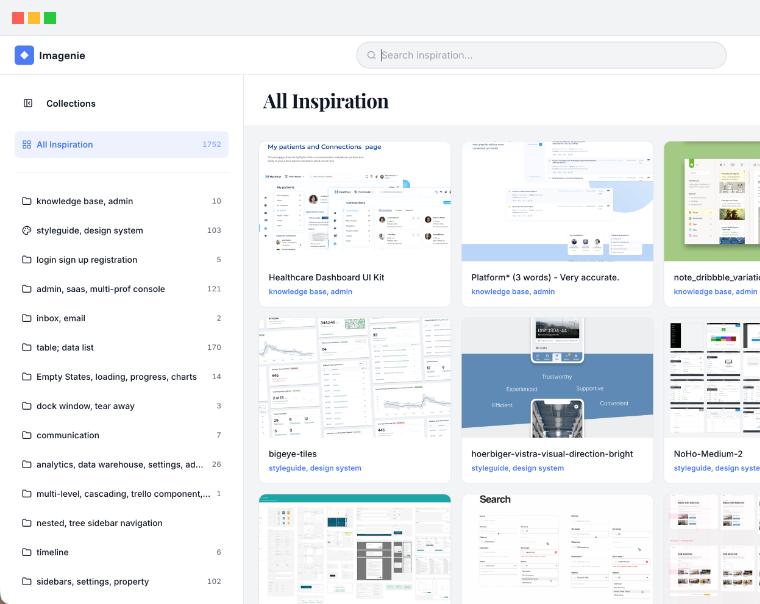

# Imagenie — UI/UX Design Inspiration Portal

🌐 **Live Demo**: [https://rupamdas1992.github.io/web-inspiration/](https://rupamdas1992.github.io/web-inspiration/)

<p align="center">
  <a href="https://rupamdas1992.github.io/web-inspiration/">
    
  </a>
</p>

Imagenie is a lightweight, responsive gallery dashboard built to organize, search, and preview web UI/UX screenshot design patterns. It dynamically syncs folders and assets from a shared Google Drive library into a clean, flat React interface.

---

## ✨ Features

- **Google Drive Sync**: Auto-syncs collections from Google Drive folders via CLI (`node scripts/sync-drive.js`) on a 12-hour automated GitHub Action schedule.
- **Collapsible Sidebar**: Filter screenshots by folder name with real-time asset counts.
- **Keyboard Navigation & Lightbox**: Open screenshots in a vertical preview modal and cycle through items using visual chevrons or **Left/Right Arrow** keys.
- **Shimmer Transition Loaders**: Unified skeleton loading animations for the image container, title, and all metadata fields.
- **Flat UI Language**: Clean border-only layout with zero shadows and hover scaling.

---

## 🛠️ Tech Stack

- **Framework**: React 19 + TypeScript + CRACO
- **Styles**: Tailwind CSS v4 & PostCSS
- **UI Primitives**: Radix UI (Dialog, Aspect Ratio)
- **Icons**: Lucide React

---

## ⚙️ Quick Start

1. **Install Dependencies**:
   ```bash
   npm install
   ```
2. **Environment Configuration**: Define `PERSONAL_API_KEY` (Google Drive API Key) in your local environment or `.env` file.
3. **Sync Data**:
   ```bash
   node scripts/sync-drive.js
   ```
4. **Run Server**:
   ```bash
   npm start
   ```
